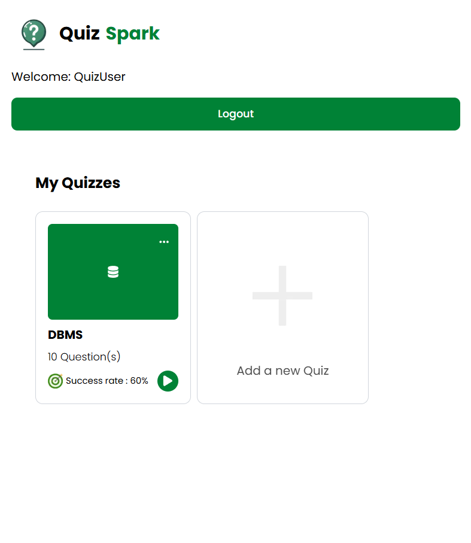
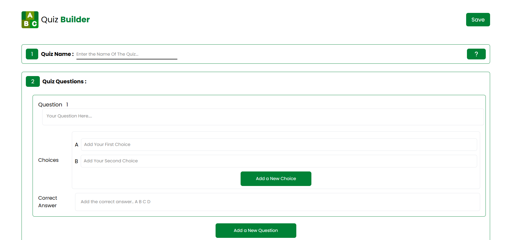
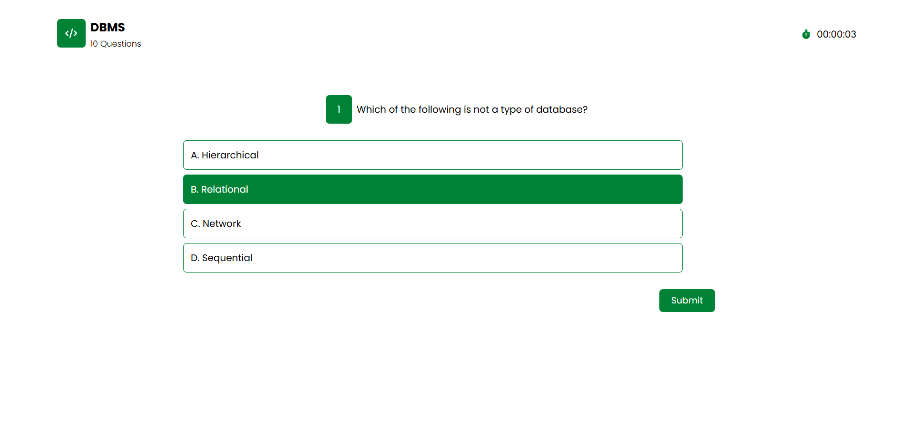
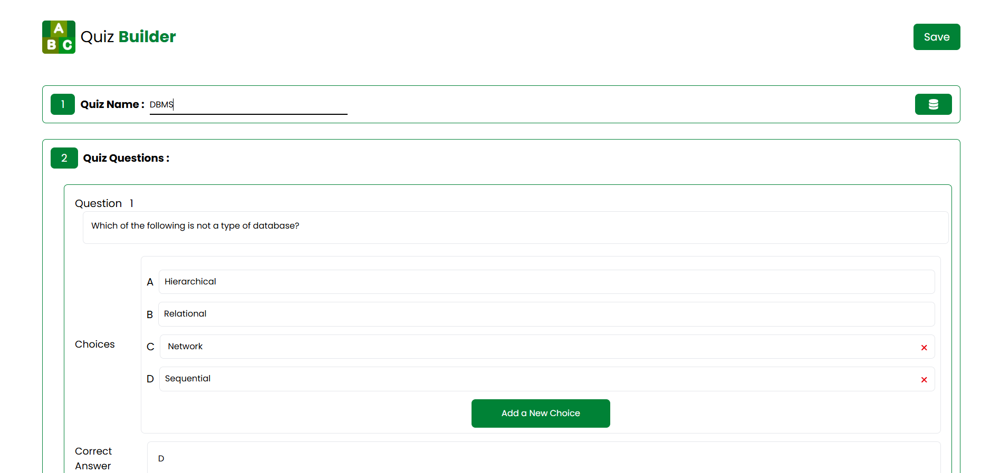

# 🧠 QUIZZY – Fullstack Quiz App

A fullstack quiz application built using **Next.js (App Router)**, **Tailwind CSS**, and **MongoDB Atlas**. Users can create, manage, and play quizzes in a modern, responsive interface.

---

## 🚀 Live Demo

🔗 [quizzy-mauve-zeta.vercel.app](https://quizzy-mauve-zeta.vercel.app)

---

## 🛠️ Tech Stack

- **Framework**: [Next.js](https://nextjs.org/)
- **Styling**: Tailwind CSS
- **Database**: MongoDB Atlas
- **State Management**: React Context API
- **Hosting**: Vercel

---

## 📸 Screenshots

### 🏠 Home Page (Quiz List)



---

### ➕ Create Quiz



---

### 🧠 Play Quiz



---

### 🛠️ Edit Quiz




---

## ⚙️ Getting Started

1. **Clone the repo**  
   ```bash
   git clone https://github.com/rahulkumar1803/QUIZZY.git
   cd QUIZZY
2. **Install dependencies**  
   ```bash
   npm install
3. **Setup** .env.local  
   ```bash
   MONGO_URL=mongodb+srv://<username>:<password>@cluster.mongodb.  net/quizzy
4. **Start The Server** 
   ```bash
   npm run dev


---

## 🚢 Deployment
Hosted on Vercel

Connect GitHub repo → Set MONGO_URL → Deploy


---

## ✅ Final Steps

```bash
use github functions 

